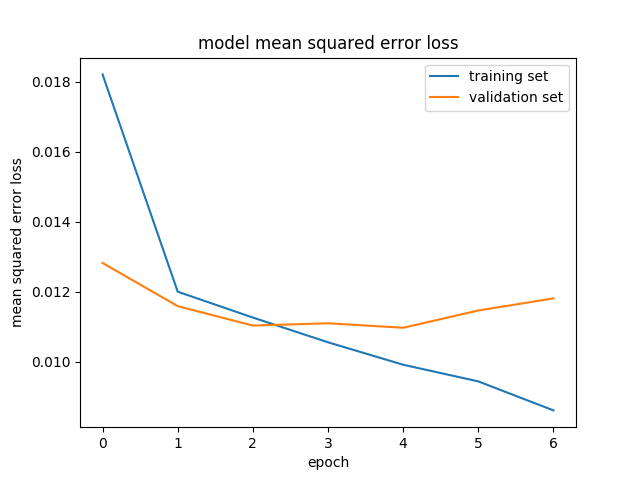

# **Behavioral Cloning Project**

The goals / steps of this project are the following:
* Use the simulator to collect data of good driving behavior
* Build, a convolution neural network in Keras that predicts steering angles from images
* Train and validate the model with a training and validation set
* Test that the model successfully drives around track one without leaving the road
* Summarize the results with a written report

## Rubric Points
###Here I will consider the [rubric points](https://review.udacity.com/#!/rubrics/432/view) individually and describe how I addressed each point in my implementation.  

---
### Files Submitted & Code Quality

#### 1. Submission includes all required files and can be used to run the simulator in autonomous mode

My project includes the following files:
* model.py containing the script to create and train the model
* drive.py for driving the car in autonomous mode
* model.h5 containing a trained convolution neural network 
* README.md summarizing the results

#### 2. Submission includes functional code

The model stored on model.h5 can be used to drive the car on the simulator track by executing:

```sh
python drive.py model.h5
```

#### 3. Submission code is usable and readable

The data_load.py file contains the code for training and saving the convolution neural network. The file shows the pipeline I used for training and validating the model, and it contains comments to explain how the code works.

### Model Architecture and Training Strategy

#### 1. An appropriate model architecture has been employed

My starting point was the architecture describe in the NVIDIA paper ["End to End Learning for Self-Driving Cars"](http://images.nvidia.com/content/tegra/automotive/images/2016/solutions/pdf/end-to-end-dl-using-px.pdf). I added a layer that normalizes the data between 0 - 1, added max pooling to the convolutional layers, and made use of an Exponential Linear Unit (ELU) activation, that is a faster alternative to RELU (https://arxiv.org/pdf/1511.07289v1.pdf).

The final architecture looks like this: 

|               Layer Type               |     Ouput Shape      |
|:--------------------------------------:|:--------------------:|
| Lambda (Normalizes image values range) |  (None, 65, 320, 3)  |
| Convolution 2D, Filters: 1, 1x1        |  (None, 65, 320, 1)  |
| Convolution 2D, Filters: 3, 5x5        |  (None, 61, 316, 3)  |
| ELU Activation                         |  (None, 61, 316, 3)  |
| Max Pooling, 2x2                       |  (None, 30, 158, 3)  |
| Convolution 2D, Filters: 24, 5x5       |  (None, 26, 154, 24) |
| ELU Activation                         |  (None, 26, 154, 24) |
| Max Pooling, 2x2                       |  (None, 13, 77, 24)  |
| Convolution 2D, Filters: 36, 5x5       |  (None, 9, 73, 36)   |
| ELU Activation                         |  (None, 9, 73, 36)   |
| Max Pooling, 2x2                       |  (None, 4, 36, 36)   |
| Convolution 2D, Filters: 48, 3x3       |  (None, 2, 34, 48)   |
| ELU Activation                         |  (None, 2, 34, 48)   |
| Max Pooling, 2x2                       |  (None, 1, 17, 48)   |
| Flatten                                |  (None, 816)         |
| Fully Connected 1                      |  (None, 1164)        |
| ELU Activation                         |  (None, 1164)        |
| Fully Connected 2                      |  (None, 100)         |
| ELU Activation                         |  (None, 100)         |
| Fully Connected 3                      |  (None, 50)          |
| ELU Activation                         |  (None, 50)          |
| Fully Connected 4                      |  (None, 10)          |
| ELU Activation                         |  (None, 10)          |
| Fully Connected 5                      |  (None, 1)           |

The idea for the convolution 2D (1, 1x1) in the second layer, was inspired by [Teaching a car to drive itself](https://chatbotslife.com/teaching-a-car-to-drive-himself-e9a2966571c5).

#### 2. Attempts to reduce overfitting in the model

* To reduce overfitting the model, I made a couple of tests with a subset of the data, and find out that the loss reached a low point in the epochs 7 to 9. I set the model training to 7 epochs.

* To prevent noise that could confuse the model, I cropped the image at the top and the bottom, to eliminate the part of the sky and also the hood of the car. 

* The data was also normalizes to a range between 0 and 1.

#### 3. Model parameter tuning

The model used an adam optimizer, so the learning rate was not tuned manually (data_load.py line 166).

#### 4. Appropriate training data

I drove the simulator counterclockwise 4 to 5 times, always trying to keep the center of the road. Then, I did the same in the inverse way. I identified some spots that could be difficult for the model to learn, for example the first curve after the stone bridge on the counterclockwise way, another sharp turn after this one, and the sand spot in the finishing line of the track. I did some recordings recovering from those spots, so the model could recover from them if it's necesary.

I also did a couple of runs swerving a little, to try to teach the model to recover. I'm not completely sure of the effects of this runs. 

The final data set had 44,553 images, that were the product of driving on the simulator, using a mouse. The load of the dataset is implemented by the method **load_data** in the file data_load.py.

The data was preprocessed, first removing the parts of the sky and trees (by cropping 70 pixels from the top, and 25 from the bottom) and then normalized to a range between 0 and 1. The cropping is done on the function **load_data_entry** on the line 75, and the normalization is done as part of the Keras model, using the Lambda object, on line 128:


```python
model.add(Lambda(lambda x: (x / 255.0) - 0.5, input_shape = image_shape))
```

Also, a compensation was done on the images from the side of the car, adding 0.1 of steering correction to the center steering angle in case of the left side, and subtracting the same amount to correct the angle in the right side.

The loss at the end of the training for 7 epochs was: 

* Training loss: 0.0086
* Validation loss: 0.0118




#### 5. Video
The video of the run is on https://youtu.be/v6cyFiwF_ew.
Also, the video from the car perspective is on: https://youtu.be/w_QkeCXOfHc

#### 6. Improvements

To improve the results I got with this model, I think I could have designed the network with some minor tweaks. For example, use a dropout layer. 

I didn't flip the images, or use any data augmentation at all. I'm not sure if adding more data, with a training loss of 0.086 would be efective.

The use of the other data from the simulator (throttle, brakes) to train the model, and use this output can help get a more precise driving in the simulator. 


```python

```
